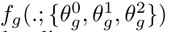

# Design
#bachelor/design/main

Open questions:

* Here the main question is how one would extend the model to accept the group of images?
	* Should be the new level on top? like new dimensions?
	* Or  should it be a new network, i.e. a new layer which will choose the image to focus on?
	* Other ideas?
* Think about classes and dependencies.
	* What modules will you have?
	* What classes will you have?
	* What functions?
* How the Tensorboard can help you visualize the results. Will it be enough? Need use some R for visualization?
* How testing will be done? Big question since I haven't seen the project NN-related written with the tests.
* Think about style guides.
- - - -

## How one would extend the model to accept the group of images?
Extension

- - - -

## UML Diagramm

<a href='./Design/RAM_Architecure.pdf'>RAM architecure.pdf</a>

- - - -

## Potential classes/modules:
1. Glimpse sensor
	* Given:
		* L_t-1 - the coordinates of the glimpse
		* X_t - input image,
		* k  - number of patches
		* g_w - number of pixel corresponding to the size of first patch
			□ each successive patch having twice the width of the previous
	* the sensor returns (extracts):
		* retina-like representation **ρ(xt, lt−1)** centered at lt−1 that contains multiple resolution patches.
		* i.e. array of multiple patches, each of different resolution with respect to the coordinates.
			* k patches are all resized to gw ×gw and concatenated
	* Note:
		* Glimpse locations l is encoded as real-valued (x, y) coordinates with (0, 0) being the center of the image x and (−1,−1) being the top left corner of x.
2. Glimpse Network
	* Given:
		* location (lt−1)
		* input image (xt)
	* Returns
		* glimpse representation gt
3. Glimpse network defines a trainable bandwidth limited sensor (hidden space):
		
	* Given:
		* retina representation ρ(xt, lt−1)
		* Location lt-1
		* Optional: activation functions
	* Returns:
		* glimpse representation gt
	* Note:
		* The output g of the glimpse network was defined as g = Rect(Linear(hg)+Linear(hl)) where hg = Rect(Linear(ρ(x, l))) and hl = Rect(Linear(l)).
		* Linear(x) = wx+b
		* The dimensionality of hg and hl was 128 while the dimensionality of g was 256 for all attention models trained in this paper.
4. Location network  fl(.; θl)
	* Given
		* Internal state ht
	* Returns:
		* Next Location lt
5. Action network fa(.; θa)
	* Given
		* Internal state ht
	* Returns:
		* Next action/classification at
		* Using softmax.
6. RNN
	* Given:
		* Internal state at previous time step t-1: ht-1
		* Glimpse representation gt
	* Returns:
		* The new internal state of the model ht
7. Reward
	* Given
		* Rewards over time steps T
	* Returns
		* Sum of rewards signal
	* Basically collect all rewards over time steps. Rewards assumable will be  delayed and sparse. Classification is correct reward = 1, wrong = -1 or 0.

For object detection in static images the state of the environment would be fixed and correspond to the true contents of the image. The environmental action would correspond to the classification decision (which may be executed only after a fixed number of fixations), and the reward would reflect if the decision is correct.

- - - -

## Questions/ Ideas:
- [x] Is the location a distribution?
Yes, it is. And we sample from this distribution.
- [x] Why authors of the original paper use hidden state to compute next location and classification? Why don't they use the external output of the network since the cell is LSTM cell?
Because it's the same, man.

**Ideas**:

* What if we do preprocessing of the images with respect to number of patches?
	* I.e. blur the whole image  before actual training
*  Using NASCell instead of LSTM cell.
	* Why?
		* Tensorflow has the implementation of it. Just one line of code to use it.
	* Impressed results
	* Definitely worth to try it out.
