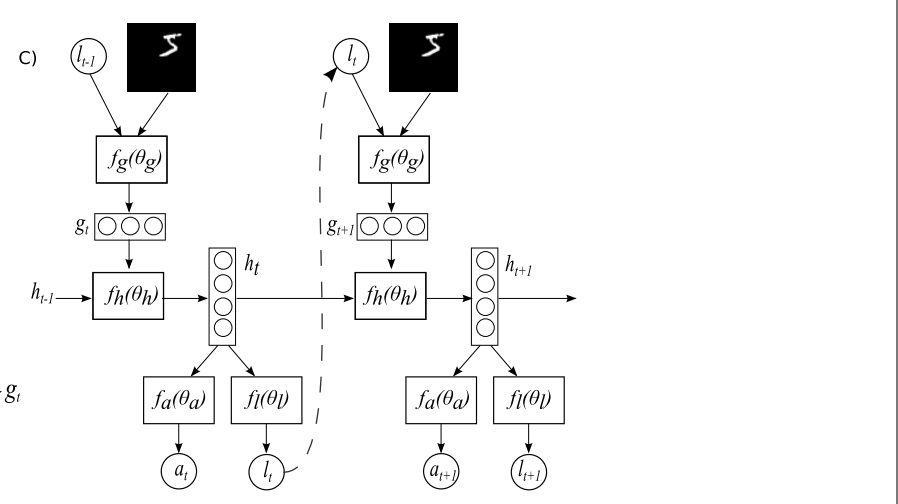

# Extension
#  How one would extend the model to accept the group of images?
#bachelor/design/main_question

## Idea 1, Extended glimpse network
For reference see the image on the top.

Currently model works as follows:

* It accepts an image and a location lt-1( x, y).
	* Location is represented as coordinates (x,y)
	* Image as an array [size_h, size_w, n_channel]
* These two is fed into a glimpse network.
* Glimpse network generated the glimpse representation gt
* This representation is the input to RNN cell.
* RNN cell outputs next state.
* This state at time-step t is used by networks fa (action network) and fl (location network) to produce classification and next location to attend respectively.

One of idea how to change the model to accept group of images:

* Firstly, let's introduce new input data:
	* We have a vector [n_images, size_h, size_w, n_channel] which will represent an array of images with length n_images
	* We have a location vector lt-1 which is [n_image, (x, y)] where n_image is a number of image.
		* This representation of location vector allow us to have n_images of attention point across all of images, i.e. one attention point for each of images.
* We need to extend/change the glimpse  network(**Extended glimpse network**)
* Accepts:
	* an array of images  [n_images, size_h, size_w, n_channel]
	* new location vector  [n_image, (x, y)]
* Does:
	* Iterates over  n_images  and calls the unchanged glimpse sensor with each pair of image and location.
	* This will produce an array of glimpse representations: [n_images, p(xt,lt-1)]
* Returns:
	* The same glimpse representation gt
* The same idea is used, we just change weights accordingly in the hidden space:

	* So we will have a slightly bigger representation gt

**Disadvantage of this approach**:
* that the model has to attend to the image(choose x,y coordinates) when there is no need for that.
	* saying that it means that if an image is not interested for a classification decision, model will still attend to this image.

**Advantage of this approach**
* it's very simple to implement.
- - - -

## Idea 2, Picker Network
For reference see the image on the top.

External output = Hidden State

Current RNN cell has an LSTM architecture, hence an external output is possible for this type of architecture. We can use the external output of the cell by new hidden space which we can call picker network. The purpose of the network is to pick an image out of group of image.

In this case we will have three networks:
* one of whose is responsible for choosing coordinates and takes as input the hidden state of the RNN
* Another network which is responsible for picking the right image to attend
	* This network will use the external output of RNN cell as the input.
* Classification network

- - - -

## Idea 3,  extended location network

We can extend location network:
* Instead of outputting (x,y) coordinates
* We can force it to output (n_image, (x,y) )

Advantage:
* Simply to implement once the base implementation is ready
* Definitely worth giving a try.
- - - -

## Idea 4,  Deep attention model

Inspired by paper [1].
Idea is to completely separate classification task from "choosing location" task.

[1]

They do it by adding a new RNN network on top r(2):
* The reason for having the second RNN is to implicitly represent decision about location and prevent using location information in classifying the image.
* Separation is crucial: first RNN network is responsible for classification, while second one for choosing the right location.
* One state will hold information about classification, while the state of RNN cell on the top will hold information about locations.

Sorry for the formatting:
* rn(2) - refers to second RNN on the top at time step n
* rn-1(2) -  refers to second RNN on the top at time step n-1
* rn(1) - refers to first RNN on the bottom at time step n
* ln+1 --> location at step n+1

#### How does the network on top work:
* State of network represent features from an input image x.
	* Initialized by output from convolution network(called Context Network) applied on the down sampled low-resolution version of input image
	* Hence: init_state = [Image_features]. Where Image_features is features that were found by convolution network.
	* Why is this done?
> "The existence of the contextual information, however, provides a “short cut” solution such that it is much easier for the model to learn from contextual information than by combining information from different glimpses."[1]  

* On each time-step the network take an input from the network on the bottom r1
* We can summarize the network as following: rn(2)  = RnnCell(rn(1), rn-1(2))
	* Where r(1) is the state of the bottom network.
* To produce the next location:
	* The internal state is fed into fully connected network named Emission network
	* Emission network
* It maps the feature vector rn(2) from the top recurrent layer to a coordinate tuple ln+1.

### How that can be helpful for the current work?

	Firstly, this is improved version of the RAM model which is adjusted for real life problems.
	The idea of separating classification and location choosing tasks seems to be very promising and reasonable as the experiments in the paper have shown.
	So we can basically apply this idea on out problem with several changes:
* We need to initialize state of the network with
	* `[number_of_images, image_features] `- where `image_features` is output of convolutional network applied on each of the input images.
	* Probably transform the above matrix into vector(possibly with fully connected layer)
* We need to change location type from tuple to `[n_image, tuple]` where tuple is (x, y) - coordinates as described in the third idea.
The rest of the architecture can remain as it is.

**Advantages**:
* The architecture is already proved by researches of the paper.
* Conceptually it should work even with these small modifications as we have this separation of concerns between location choosing and classification.

**Disadvantage:**
* Architecture is hefty, hence some problem with realization/implementation can occur.

## Idea 5, exploration network
This idea is similar to idea 2.

Currently, RAM model needs to execute a number of steps to make decision about a class.

> The attention network used in the following classification experiments made a classification decision only at the last timestep t = N.[2]  

> Finally, our model can also be augmented with an additional action that decides when it will stop taking glimpses. This could, for example, be used to learn a cost-sensitive classifier by giving the agent a negative reward for each glimpse it takes, forcing it to trade off making correct classifications with the cost of taking more.[2]  

When introducing a new action that decides when it will stop taking glimpses,  instead of making classification decision, we can take next image in a group. Once there is no more images we can force the model to make a classification decision.

**How we can do that?**
* Introduce new network which take as input the state of RNN cell, and output  0 or 1 which corresponds to whether the model will stop taking new glimpses or continue to explore image respectively.
* I.e. exploration network:
	*  `continue_to_explorer ∼ p(·|f_e(h_t; θ_e))`
	* Where `h_t` - internal state from RNN cell, `f_e` - is NN with weights `θ_e` and softmax output.

**Advantage**:
* Simplicity:
	* Easy to understand
	* Easy  to implement
* Can be extended even further:
	* We can introduce three actions:
		* Go back -> take the previous image
		* Go next -> take the next image
		* Finish -> stop taking glimpses
* Can be combined with idea number 4.

**Disadvantage**:
* Information in state may be not enough to make right decision.

- - - -

[1] - Ba, J. L., Mnih, V., & Kavukcuoglu, K. (2015). Multiple Object Recognition With Visual Attention. Iclr, 1–10. Retrieved from https://arxiv.org/pdf/1412.7755.pdf
[2] - Mnih, V., Heess, N., Graves, A., & Kavukcuoglu, koray. (2014). Recurrent Models of Visual Attention. Advances in Neural Information Processing Systems 27, 27, 1–9. https://arxiv.org/abs/1406.6247
